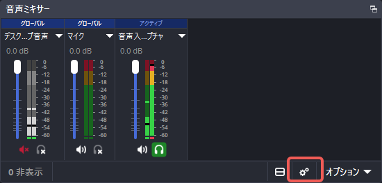
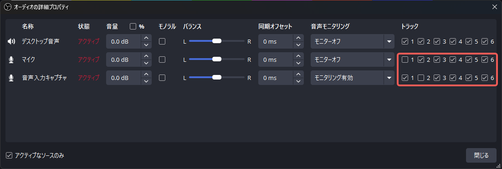
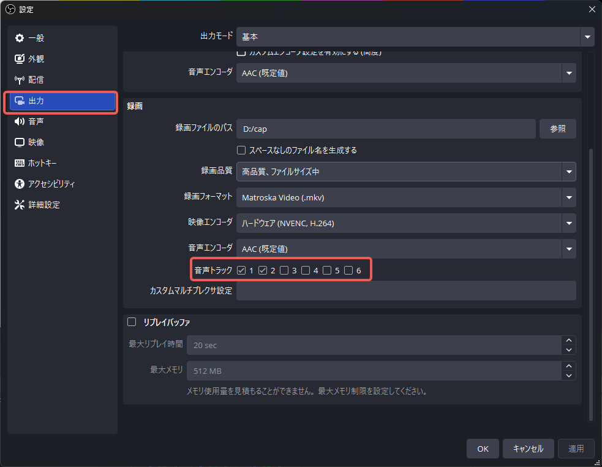

[English](README.md) | [日本語](README_ja.md) | [简体中文](README_zh.md)

# SheepBell - ゲームLQA用 自動動画クリップ & 文字起こしツール

OBS等で録画されたゲームプレイ動画の特定マイク音声トラックから「テスターの発話区間」を自動検知し、**全音声トラック保持動画クリップ・開始0.1秒スナップショット画像・Faster-Whisper文字起こし・CSV/JSON構造化データ**を自動生成するツールです。

## 🌟 主な機能
- **4ステップ疎結合設計**:
  - **Step 1 (マイク音声抽出)**: FFmpegを用いて指定トラックから16kHzモノラルWAVを高速抽出
  - **Step 2 (発話区間検出)**: PyTorch Silero VADにより高精度に発話タイムスタンプを検出
  - **Step 3 (マージ & 文字起こし & 出力)**:
    - 無音許容時間・前後マージンを考慮して発話を統合
    - **Faster-Whisper**（ローカル実行 / APIキー不要）により各区間の発話を自動テキスト化（日・英・中・自動検出）
    - `lqa_issues.json` および **Excel/Googleスプレッドシート互換の `lqa_issues.csv` (UTF-8 BOM)** を同時出力
  - **Step 4 (全トラック保持クリップ & 静止画生成)**:
    - FFmpeg `-map 0 -c copy` により、ゲーム音・マイク音など**全音声トラックを保持したまま再エンコードなしで数秒で切り出し**
    - 各Issueの開始+0.1秒のスナップショット画像（`issue_001.png`）を自動生成
- **直感的なWeb UI (Gradio)**:
  - ファイル名Prefix（例: `stage1`, `bug`）や開始ID番号（例: `10`）を指定可能
  - パラメータ調整、ステップ個別実行、リアルタイム実行ログ表示

---

## 動画ファイルの準備

SheepBell では、テスターの声を、テスト対象やデスクトップの音声とは別の音声トラックに録音することを推奨します。
別の音声トラックにすることで、テスト対象の音声によってテスターの音声がマスクされることを防げるほか、テスト対象内にそもそもボイスオーバーが入っていた場合の誤検知も予防できます。

以下は OBS での設定例です。

1. [オーディオ] ペインで歯車のアイコンをクリックし、 [オーディオの詳細プロパティ] を開きます。



2. マイク音声をトラック2、ゲーム音をトラック1に割り当てます。このとき、もう一方のトラックにはチェックが入っていないことを確認してください。



※ この例ではデスクトップ音声はミュートにしているため、設定を変更していません。お使いの環境に合わせて適宜調整してください。

3. [コントロール] ペインの設定をクリックし、[設定] を開きます。


4. [出力] タブの [録画] セクションを開き、音声トラックの欄で出力したいトラックすべてにチェックが入っていることを確認してください。



これで作成された動画ファイルには、指定したトラックすべてが含まれるようになります。

きちんと録画できているか確認するには、MediaInfo で情報を見るか、VLC やメディアプレイヤーなどで音声トラックを選択してみてください。

> [!NOTE]
> SheepBell には音声トラックの選択画面で 30 秒分のプレビューが可能です。
> テスト開始前に「〇月〇日、今から〇〇のテストをします」などの情報を吹き込んでおけば、トラックの判別が容易になることに加え、テストのインデックスにもなるためおすすめです。

## プログラムの起動

SheepBell はローカル環境または Google Colab で実行可能です。
ローカルで実行するには uv や python が必要となります。環境構築が難しい場合は、Google Colab で実行することを推奨します。

### 💻 ローカル環境での実行 (Windows / Mac / Linux)

#### 前提条件
- **Python 3.10+** (uv 推奨)

#### 起動方法
```bash
# 依存関係のインストール
uv sync

# Gradio UI の起動
uv run python app.py
```
ブラウザで `http://127.0.0.1:7860` を開いてください。

---

### ☁️ Google Colab での実行 (GPU無料枠対応)

リポジトリ直下の [`colab_sheepbell_ja.ipynb`](colab_sheepbell_ja.ipynb) を Google Colab にアップロードして実行するだけで、GPU（T4）環境上で爆速文字起こし＆動画切り出しが可能です。

1. Google Colab で `colab_sheepbell_ja.ipynb` を開く（ランタイムのタイプを「T4 GPU」に設定）。
2. Google Drive をマウント（動画ファイルの受け渡しがスムーズになります）。
3. セルを実行して `!python app.py --share` を起動。
4. 発行された `https://xxxx.gradio.live` のURLを開いて利用。

---

または、以下の URL から Google Colab のノートブックを開き、[ファイル]>[ドライブにコピーを保存]を選んで、自分のドライブで使用することもできます。
[Google Colab](https://colab.research.google.com/drive/16QP6Icwj6o253Chpfzn9itJU2EEMMRvg?usp=sharing)

### 🧪 テスト実行

```bash
uv run pytest
```

## 使い方

### 画面構成


### 操作手順

1. 動画ファイルパスを入力する（絶対パス・相対パスいずれも可。Colab実行時は相対パス推奨）
2. （複数の動画がある場合）出力先ディレクトリやファイル名の命名ルール、インデックスの開始番号などを設定
3. 音声トラックの確認。視聴をすると確実
4. 文字起こしを行う場合は、言語を選択
5. 「処理を開始する」をクリック
6. ログに完了が表示されるのを待つ

これで指したフォルダに以下の項目が作成されます。

1. 問題点をまとめたファイル（JSON および CSV。Colab で起動した場合はさらにスプレッドシート）
2. 問題箇所のスクリーンショットおよび動画

> [!NOTE]
> 上記の設定は、以下の項目以外はデフォルトでも動くようになっています。
> 精度を求めるなら微調整が必要になります。その際は、テストを数回繰り返して最適な値を探ってください。
